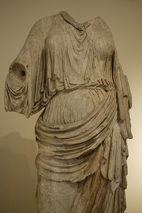

#### 序  

  法律と風習とによって、ある永劫えいごうの社会的処罰が存在し、かくして人為的に地獄を文明のさなかにこしらえ、聖なる運命を世間的因果によって紛糾せしむる間は、すなわち、下層階級による男の失墜、飢餓による女の堕落、暗黒による子供の萎縮いしゅく、それら時代の三つの問題が解決せられない間は、すなわち、ある方面において、社会的窒息が可能である間は、すなわち、言葉を換えて言えば、そしてなおいっそう広い見地よりすれば、地上に無知と悲惨とがある間は、本書のごとき性質の書物も、おそらく無益ではないであろう。  
  

　　一八六二年一月一日  

オートヴィル・ハウスにおいて  

ヴィクトル・ユーゴー  

